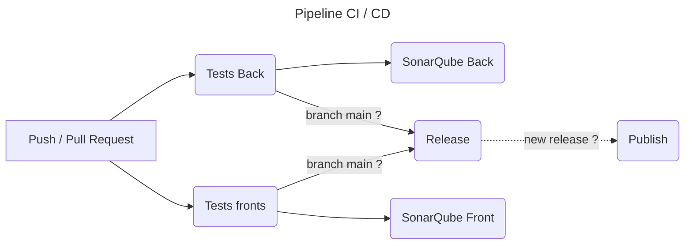

# Pipeline CI/CD

## CI

### Résumé



### Détail du workflow

> les secrets suivants doivent être créés : `SONAR_TOKEN`, `SONAR_PROJECT_KEY`, `SONAR_ORGANIZATION`

- toutes les actions 
    - ont des auteurs certifiés par github 
    - sont taguées par sha du commit
- `actions/checkout@v6.1` 
    - `fetch-depth: 0` permet de récupérer tous les commits, utile pour sonarqube et la détermination de la version sémantique
- `actions/setup-java@v.5.7.0`
    - `cache: gradle` permet d'accélérer les builds successifs
- `sonarqube-scan-action@v8.2.1`
    - récupération des secrets en variables d'environnement pour éviter de les afficher par erreur
- `actions/setup-node@v6.5.0`
- `browser-actions/setup-chrome@v2.1.2`
    - chrome est nécessaire pour jouer les tests automatisés coté front
- `RUN npm ci` force l'installation des dépendances et passe en erreur si il n'y a pas de `package-lock.json`
- `if: ${{ github.ref == 'refs/heads/main' }}` pour les jobs release et sonarqube que l'on souhaite exécuter uniquement sur la branche main
- `if: ${{ needs.release.outputs.new_release_published == 'true' }}` on ne publie les nouvelles images que s'il y a une nouvelle version détectée
- `upload-artifact@v7.0.0` upload les rapports de tests front et back
- `build-push-action@v7.3.0` push les images sur ghcr.io
    - `needs.release.outputs.new_version` permet de récupérer la version générée dans le job `release`

### Plan de testing

#### Objectifs

- Non régression : les nouvelles fonctionnalités ne cassent pas les fonctionnalités existantes
- Validation : les nouvelles fonctionnalités font ce qui est défini dans les spec fonctionnelles
- Qualité logicielle : analyse du code et détection des mauvaises pratiques

#### Périodicité

Le workflow se déclenche sur un push / pull request 

Détail des actions par événement:

| Evenement \ Job | Tests + SonarQube Back| Tests + SonarQube Front | Release | Publish |
| --- | --- | --- | --- | --- |
| Push ( main + nouvelle release) | ✅ | ✅ | ✅ | ✅ |
| Push ( main ) | ✅ | ✅ | ✅ | --- |
| Push ( hors main ) | ✅ | ✅ | --- | --- |

#### Types de tests

- Backend
    - smoke test 
        - MicroCRMApplicationTests : teste le démarrage des composants spring spring
    - tests d'intégration 
        - PersonRepositoryIntegrationTest : test qu'un repository accède bien à la BDD pour récupérer un utilisateur par email
- Frontend
    - tests des composants

### Plan de sécurité

#### Dans la pipeline

Les règles de sécurités suivantes ont été appliquées :

- épingler les hash des actions pour éviter le 
- utiliser des actions de compte validés par github
- utiliser de secrets pour les token
- appliquer le principe du moindre privilège
- commiter les lockfiles et utiliser npm ci

#### SonarQube

SonarQube a été intégré dans la pipeline pour systématiser l'analyse statique du code.

Il vérifie les problèmes suivants

- vulnérabilités connues
- code smells
- couverture du code par les tests automatisés

### Plan de déploiement

A chaque push sur main ET si une nouvelle version est détecté ( en utilisant le semantic versionning ), les images ( front, back et standalone ) sont publiées sur le Github Container Registry.

Les images publiées sont taguées comme `latest`, avec le `sha` du commit et la version de l'application

#### Livraison

On peut utiliser docker compose pour installer les services sur le serveur de production.

> prérequis : 
> - docker est disponible sur le serveur
> - l'image a été build et est disponible sur ghcr

```sh
# Accéder au serveur
ssh <user>@<server_name>
# créer un fichier docker-compose.yml
touch docker-compose.yml
# avec un éditeur de texte copier coller le contenu de `docker-compose-prod.yml` dans un fichier `docker-compose`
# sauvegarder le fichier
# dans le terminal taper la commande
APP_LABEL=latest docker compose up -d --pull=always
```

#### Déploiement en prod

Pour déployer les nouvelles images sur le serveur de production, il sera possible d'utiliser les commandes suivantes :

```sh
# connexion au serveur de prod
ssh <user>@<prod_server_name>
# le fichier docker-compose.yml est déjà sur le serveur cf la partie "Livraison"
# arrete l'instance actuelle
docker compose down
APP_LABEL=latest docker compose up -d --pull=always
```

#### Rollback

```sh
## en cas d'erreur
# arreter les container en cours
docker compose down
# relancer avec l'ancienne version
APP_LABEL=1.1.2 docker compose up -d --pull=always
```

### Plan de sauvegarde

- BDD : sauvegarde **quotidienne** du volume docker où la BDD est persistée ( non applicable actuellement car la BDD est en mémoire )
- Toute la configuration de l'application est sauvegardée à chaque push sur github
